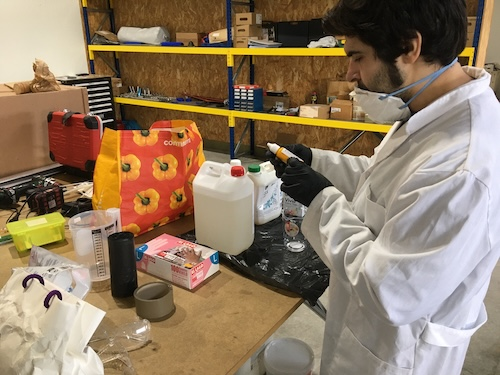
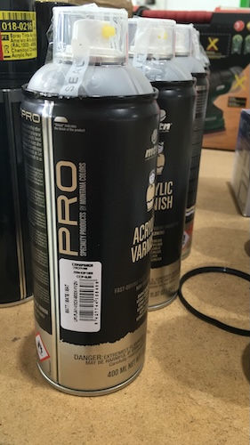
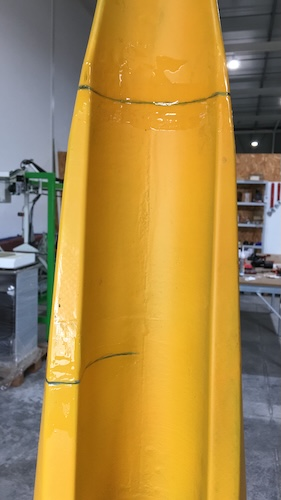
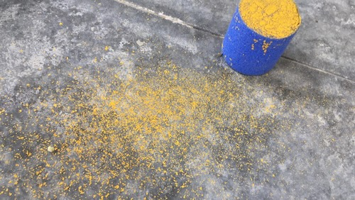
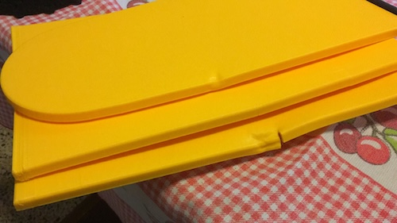
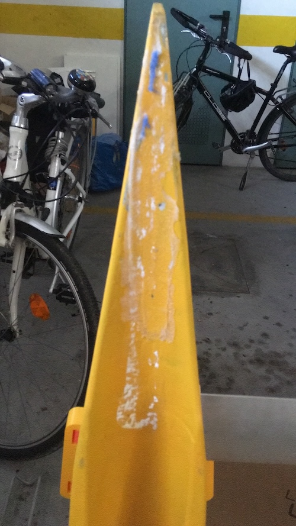
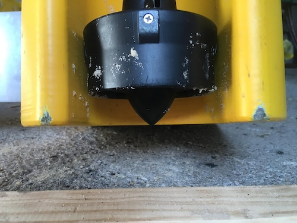

# 2019

## July ##

### Idea

Design and build a small-scale, autonomous catamaran (1.2m) capable of carrying a 10 kg payload with 2-hour operating endurance and be constructed primarily from sustainable materials (70% or more). A key feature is the ability to easily integrate internal and external sensors, with a focus on cost-effective and simple repairability.

This vessel could be used as a platform for maritime engineering training and aquatic bioecochemistry or water quality assessment. 

It will uses modeling and 3D printing with PLA, with the possiblility of exploring new ecofriendly materials: environmentally friendly from the very begining of the conceptualization until the moment that is out of service.

The control, in a early stage, is by radio and GPS way points using Mission Planner of ARDUPILOT software opensource community. If needed could have an avoidance system. ARDUPILOT, is an open-source autopilot software suite where mission Planner is a product. 

The energy system should use Samsung 18650 cells in a two bateries 4S4P setting in paralell (16.8 V). This system can be charged with solar pannels or a 220 V home energy source.

For the spare parts it should have cheap components easily available on the market.

It all strated here, at FAB ACADEMY 2019, held in FCT FAB LAB at Nova University: https://fabacademy.org/2019/labs/fct/students/antonio-gomes/projects/final-project/

# 2023

## July ##

CAD design

## September ##
Printed parts at MAUSER 3D printing services:[MAUSER](https://mauser.pt/catalog/)

### Security ###

Using gloves and special masks.

# 2024 #
## Jannuary ##
Glueing the parts at the António Narçal workshop.
Workshop overview!

We are using the bodyboard as a testing for all of the processes.

## February ##
Resin the hulls. Because of the weather its was a very slow process. 
We never reach the minimum temperature of 21 degrees and 60% of humidity.

As youu can see, there is a chemical reaction between the resin and the paint. The good news is that, if you repaint, it will vanishes! great!!!

And what an ammount of garbadge.

Primary painting. All the errors appear!

## March ##

Fill the holes and repaint after sanding, sanding and sanding. Repaint again. This process is not going well because it continues to react showing spots of orange (see pictures). We think to change the process in order to have more 3D printed only and putting the UV paint only. It avoids a lot of work and mess.

## April ##

In April we finnaly concluded the painting.

We did the UV paint with this brand.

The process is not environmentally friendly as we suspected: so, we plan to produce this catamara in a different way by taking the 3D printing strategy further, meaning that, we do not wanted to add to much to the 3D printing process, just the UV painting, and we want to assume the 3D printing "anommalous" desing by not be embarassed because of this consequent strange design. We will not 

## May ##

Spaghetti time. Designing the wiring and accomodating the hardware to control the AQUA.

We are also looking the way to adjust, with flexible material, the front and rear bars that go inside the boat. They are connected by two screws in each side.

Future: looking forward to test it in a pool. 

## July ##
Cleaning was a task at this point and measuring the type of garbage and the weight in percentage of the catamaran is a reference to take the sustainability into account. The complete weigth of the catamaran is 20,5 Kg with an error of 0,2 Kg. So the waste produce in the fabrication of the catamaran is 22,1 Kg, 107,8 % of the mass of the catamara. Since we don't know how to process this catamara in is end of life, we coclude that, at that time, there will be 42,6 kg of waste, which include eletronic parts and plastic less environmentaly friendly. So, in the end of his life there will 207,3% of waste, compared to the mass of the catamaran.

| Type  | Weigth (kg) | % |
| ------------- | ------------- | ------------- |
| Paper  | 1,2 | 6 |
| Cardboard | 5,6 | 2,7 |
| Plastic  | 5,8 | 2,8 |
| Painting cans | 1,8 (18 cans) | 0,1 |
| Metal | 3,4 | 0,2 |
| undifferentiated waste | 4,3 | 0,2 |

In July we stop here:

## September and October##

This month is devoted to plannning and assembled the top, cameras, antennas and water test.

## October ##

This month is devoted to plannning and assembling. Redesign the power circuit.

## November and December##

Test the microcontroller circuit and the power circuit as well. Radio transmitter settings. Ground and Water tests. Spagheti time! Designing and accommodating all the wiring and hardware components to controle the AQUA. We will use ARDUPILOT in is boat (rover) version: tested and working properly!

## January 2025
Remodeling 3D and printing electronic box. Printing and modeling the battery holder. Built 4S4P batery with the help of LCD Porto Maker Space, by crimping.

## February
Buoyancy testing.

We found a structural break in the hull. Perhaps because of a falling situation when removing from the car. Preparing to fix it.

We are going to try to fix it. 

We reprint the access hatch in the top of both hulls with less holes then before, since we decided to have only one openning for the telemetry antenna. This aquatic plataform will serve as a base to have anything that the school need. We reprint the eletronic box and made the battery 4S4P.

## March

Structural break fixed. After sanding and cleaning with a dremel, and prepared the epoxi glue the results:

Thinking about the unbalance hull. That's a big issue that didn't appear so important but with the real hull it appears very disturbing. Two solutions, taking in account that this is a prototype: 

1. modeling a boid to attach to the bow in order to balance it;
2. glue a foam under the bow.

# Tasks
- [x] Structural break;
- [x] Assemble the last cleat;
- [x] Glue the foam to the bow;
- [x] Paint with yellow and varnish;
- [x] Attach security light
- [x] Testing...

## May

The top covers were left unvarnished to directly observe the behavior of the PLA material and compare it to the varnished sections. Foam was adhered to the underside of the hulls to enhance the catamaran's stability. Elastic structures were integrated to securely fasten the covers. Finally, the last coats of paint were applied, and the top hull covers were tightened to improve water tightness. The paint didn't work weel in the foam.

- [X] Remodeling the top hull covers in order to be more water tight;
- [X] Fix the hatchs with holding belts;
- [X] Make the second 4S4P batery;
- [x] Print the batery holder;
- [x] Security safety buoy;
- [x] Seal the motor holes in the hull;

## June

We have made a heavy testing of the boat. Even the transportation was a testing point. The boat is to wide for the van. yes!!! Wrong turn!!!We need to cut the floats stringers by 7 cm. 

The heat was another testing point. 

The top covers were replaced because the rubber fixers where not appropiate for the heat during the transportation incide the van. The new top covers where made with EPS machineed at the Porto de Mós FAB LAB.

We also print parts to insure that the water doesn't get inside the hulls. We also modeled fixers for the top float covers that use straps .

This is crucial. We need to glue the front floaters or the boat will not be horizontal in the water (see February pictures). During the transportation they got out. Another wrong turn!

## July

- [x] Second batery on the 3D printed cover
- [x] Screw the motors better
- [x] Check the electrical cables fixation
- [x] Presence light (not only for the night but to test the transmiter connectivity to the system)
- [x] Testing the boat by radio controler and GPS waypoints;
- [x] Testing testing testing...
- [x] Transportation in the field
- [x] Minimal tools
- [x] Using procedure

Tomorrow I'm going to assemble the engine. It was removed when I moved it on the table. Issues around the use of the boat.

Boat ready to test. We machine the parts on the FAB LAB CNC machine of Porto de Mós FAB LAB. Fix them with flat ropes.

## August

Tests on 10 August. Add a handcart to move it easily.

It goes ok as you can see in the video. The bow is a little bit down but we will add more flutuability in the next iteraction. Everything was fine... When I opened it, it has water inside!!! Brr....

In the next day I weard water moving also inside. The boat is taking on water, I don't know where from. I should none that because hobbiecat does that...

Water testing.

Conclusion: water is coming in through the four screw holes and the both electrical wires that powers the engine. But it doesn't go directly into the boat, it enters the hull and then comes out through interior grooves in the bow... that are result of the way the boat was built... I'll insulate it as best I can... and hope for the best. I use silicone in the wire hole and the screws.

Notice that the starboard paint peeled off.

Apply silicone... dry for 6 hours and put it on water again.

Took water inside again but less... but it worked... buzzer ringing again.
Interior water also. F...

Today, Sunday, it's drying! I put it back also. Lift it in several positions for the ware to came out from the grooves: it was upside down because the water comes out inside, at the stern, and then drains inside, but at the top of the hull.
when tilted, you can no longer hear the sound of water inside.

Possible entries points. Need procedures to handle the boat. I will try to test the way points. In spite of not having internet on the locals we can use fetching with MP.

Conclusion: No data collected yet... just see what's going on... audible warnings... battery heating... we should have an internal temperature sensor. Strange sound... try to understand what it means... it's not from the pixwack because we don't have the buzzer (well, we don't have it now but we had it, it broke)... but the button to start the engines before arming in the MP software... it has... investigate what it means. It working alright. We will came back to it in October, now, vacations!

Video: https://www.youtube.com/watch?v=jL261LpirRE

## September
Repaint everything. Hard work that need to be done! Paint, holes repair and primary

All set disassembled.

Minimal tools to disassembled.

Destails, starboard and port board.

Eletrical part.

Reparing th boat confront us with the epoxy problem, that were two problems:
1. waterproof epoxy: we didn't use it;
2. we should have sanded the PLA to create roughness;

Always learning in the hard way.

## October

- [x] Valves: buy
- [x] Engine covers, buy
- [x] more flutuability to the bow: improve with a bolt...
- [x] BUY the flag
- [x] PVC for the holes of the motor atachment
- [x] Buy lights: white, red, green!?
- [x] Procedures

- [ ] ...and print 3d part.
- [x] repair and paint the hulls (see procedure bellow)

- [ ] GPS problem: no led light blinking...
- [ ] beeps!? (https://ardupilot.org/rover/docs/common-sounds-pixhawkpx4.html#common-sounds-pixhawkpx4)

- [ ] Charging procedure: improve circuit and carefully with both bateries in mind;
- [ ] MP parameters: see discussion on ArduPilot AHRS Discourse and about the voltage accurancy
- [ ] Test voltage values and adjust it;

- [ ] removable protections for corners, bow and stern

- [ ] Download log data procedure
- [ ] Get test sites maps with APM fetching
- [ ] Tests

We plan to repaint the hulls in October. We will follow this **procedure**:

1. 3D printing the bow floats;
2. Sand the hulls to remove the paint as much as possible (120 to 220);
3. Prepare the holes for the bow floats, thruster cables, valves and the three lights (red, green and white);
4. Close the holes (prepare the repair compound using two spatulas: just a drop of hardener is enough);
5. Wait 24 hours;
6. Sand the parts where we applied the repair compound;
7. Clean with a sponge;
8. Apply epoxi primer with the paint roller and brush: after preparing we have two hours to apply it;
9. Wait 1 day and paint: if you can't, Wait 5 days for the paint to become glazed, sand again with 220-grit sandpaper and paint (the sanding is for the paint adhesion;
10. Apply yellow enamel paint (polyurethane plus acrylate) with the roller and the brush:
    (a) stir well before mixing;
    (b) make half and then the rest if needed: after two hours the rest is not reusable: clean the brush with thinner and throw away the rolls;
12. Wait two days;
13. Repaint if needed;
14. Mount the structure, flag, lights, eletronic and eletrical parts;
15. Test, test, test and test!

## November

- [ ] Tests
- [ ] Nicla Vision WIFI: print and assemble
- [ ] include calcs for the 4S4P batery in this journal;
- [ ] Put the vynil logos (email entities)
- [ ] minimum tools
- [ ] Write the manual with procedures to handle the boat carefully
- [ ] Review BOM costs;
- [ ] Review material waste weight;
- [ ] Review documentation: manual, procedures, safety and maintenance
- [ ] Review text file business

# Next 2026 task
- [ ]  after service, what should it be used for?
- [ ]  Deliver for training and testing (IPL);
- [ ] Paint needed or why print in yellow?
- [ ] Prepare the new designs;
- [ ] Print with obliquo roller printer;
- [ ] Solar charging proceding and materials?!
- [ ] Packaging
- [ ] Prepare the inauguration and delivering
- [ ] Discuss and prepare comunication and marketing project presentation for investors support;
- [ ] 3 faires
- [ ] Financing
- [ ] (...)
- [ ] NEXT project phase: decide how to make the avoidance system, by camera using the human control or autonomously by pattern detecting: perhaps both?

