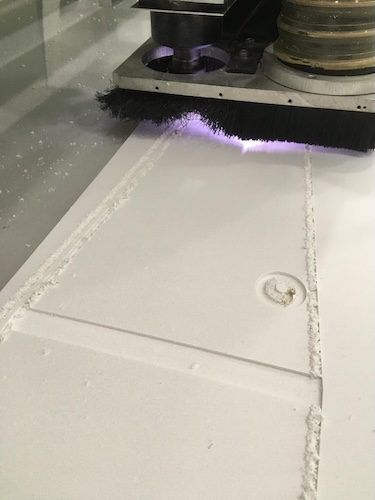
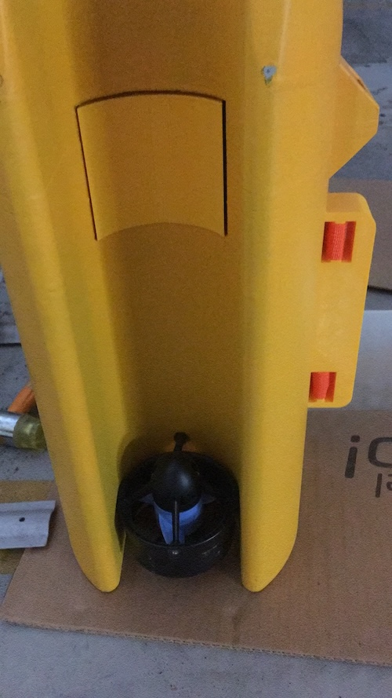
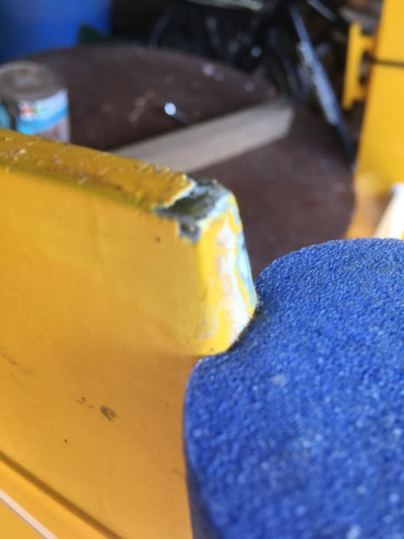
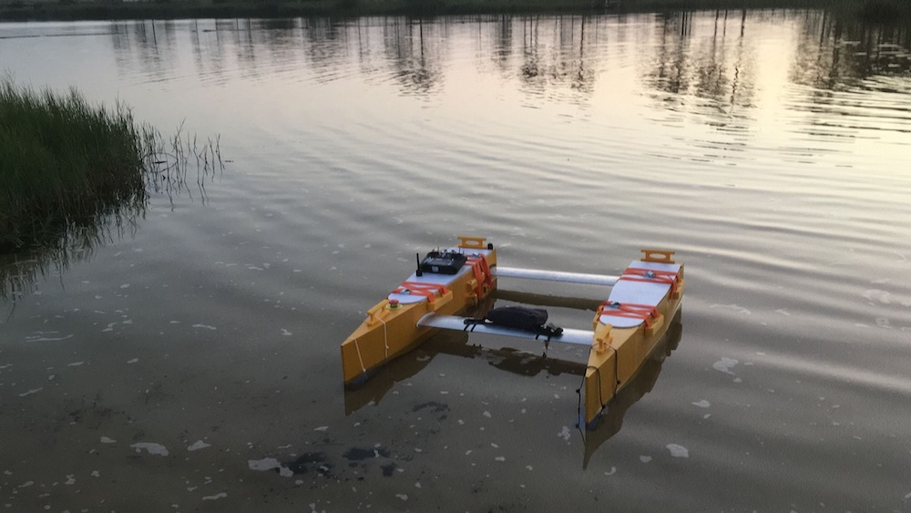

# 2019

## July ##

Idea: build a small catamara (1,2 m) to be used on maritime engeneering training and water bio research. It should be 70% sustainable from A to Z. It should use 3D printing with new materials, and be more environmentally friendly from the very begining of the conceptualization until the moment that is out of service: what shoul it be used for? It should run by GPS way points and have an avidance system. It should user friendly and built with cheap components available on the market.

# 2023

## July ##

CAD design

## September ##
Printed parts at MAUSER 3D printing services:[MAUSER](https://mauser.pt/catalog/)

### Security ###

Using gloves and special masks.

# 2024 #
## Jannuary ##
Glueing the parts at the António Narçal workshop.
Workshop overview!

We are using the bodyboard as a testing for all of the processes.

## February ##
Resin the hulls. Because of the weather its was a very slow process. 
We never reach the minimum temperature of 21 degrees and 60% of humidity.

As youu can see, there is a chemical reaction between the resin and the paint. The good news is that, if you repaint, it will vanishes! great!!!

And what an ammount of garbadge.

Primary painting. All the errors appear!

## March ##

Fill the holes and repaint after sanding, sanding and sanding. Repaint again. This process is not going well because it continues to react showing spots of orange (see pictures). We think to change the process in order to have more 3D printed only and putting the UV paint only. It avoids a lot of work and mess.

## April ##

In April we finnaly concluded the painting.

We did the UV paint with this brand.

The process is not environmentally friendly as we suspected: so, we plan to produce this catamara in a different way by taking the 3D printing strategy further, meaning that, we do not wanted to add to much to the 3D printing process, just the UV painting, and we want to assume the 3D printing "anommalous" desing by not be embarassed because of this consequent strange design. We will not 

## May ##

Spaghetti time. Designing the wiring and accomodating the hardware to control the AQUA.

We are also looking the way to adjust, with flexible material, the front and rear bars that go inside the boat. They are connected by two screws in each side.

Future: looking forward to test it in a pool. 

## July ##
Cleaning was a task at this point and measuring the type of garbage and the weight in percentage of the catamaran is a reference to take the sustainability into account. The complete weigth of the catamaran is 20,5 Kg with an error of 0,2 Kg. So the waste produce in the fabrication of the catamaran is 22,1 Kg, 107,8 % of the mass of the catamara. Since we don't know how to process this catamara in is end of life, we coclude that, at that time, there will be 42,6 kg of waste, which include eletronic parts and plastic less environmentaly friendly. So, in the end of his life there will 207,3% of waste, compared to the mass of the catamaran.

| Type  | Weigth (kg) | % |
| ------------- | ------------- | ------------- |
| Paper  | 1,2 | 6 |
| Cardboard | 5,6 | 2,7 |
| Plastic  | 5,8 | 2,8 |
| Painting cans | 1,8 (18 cans) | 0,1 |
| Metal | 3,4 | 0,2 |
| undifferentiated waste | 4,3 | 0,2 |

In July we stop here:

## September and October##

This month is devoted to plannning and assembled the top, cameras, antennas and water test.

## October ##

This month is devoted to plannning and assembling. Redesign the power circuit.

## November and December##

Test the microcontroller circuit and the power circuit as well. Radio transmitter settings. Ground and Water tests. Spagheti time! Designing and accommodating all the wiring and hardware components to controle the AQUA. We will use ARDUPILOT in is boat (rover) version: tested and working properly!

## January 2025
Remodeling 3D and printing electronic box. Printing and modeling the battery holder. Built 4S4P batery with the help of LCD Porto Maker Space, by crimping.

## February
Buoyancy testing.

We found a structural break in the hull. Perhaps because of a falling situation when removing from the car. Preparing to fix it.

We are going to try to fix it. 

We reprint the access hatch in the top of both hulls with less holes then before, since we decided to have only one openning for the telemetry antenna. This aquatic plataform will serve as a base to have anything that the school need. We reprint the eletronic box and made the battery 4S4P.

## March

Structural break fixed. After sanding and cleaning with a dremel, and prepared the epoxi glue the results:

Thinking about the unbalance hull. That's a big issue that didn't appear so important but with the real hull it appears very disturbing. Two solutions, taking in account that this is a prototype: 

1. modeling a boid to attach to the bow in order to balance it;
2. glue a foam under the bow.

# Tasks
- [x] Structural break;
- [x] Assemble the last cleat;
- [x] Glue the foam to the bow;
- [x] Paint with yellow and varnish;
- [x] Attach security light
- [x] Testing...

## May

The top covers were left unvarnished to directly observe the behavior of the PLA material and compare it to the varnished sections. Foam was adhered to the underside of the hulls to enhance the catamaran's stability. Elastic structures were integrated to securely fasten the covers. Finally, the last coats of paint were applied, and the top hull covers were tightened to improve water tightness. The paint didn't work weel in the foam.

- [X] Remodeling the top hull covers in order to be more water tight;
- [X] Fix the hatchs with holding belts;
- [X] Make the second 4S4P batery;
- [x] Print the batery holder;
- [x] Security safety buoy;
- [x] Seal the motor holes in the hull;

## June

We have made a heavy testing of the boat. Even the transportation was a testing point. The boat is to wide for the van. yes!!! Wrong turn!!!We need to cut the floats stringers by 7 cm. 

The heat was another testing point. 

The top covers were replaced because the rubber fixers where not appropiate for the heat during the transportation incide the van. The new top covers where made with EPS machineed at the Porto de Mós FAB LAB.

We also print parts to insure that the water doesn't get inside the hulls. We also modeled fixers for the top float covers that use straps .

This is crucial. We need to glue the front floaters or the boat will not be horizontal in the water (see February pictures). During the transportation they got out. Another wrong turn!

## July

- [x] Second batery on the 3D printed cover
- [x] Screw the motors better
- [x] Check the electrical cables fixation
- [x] Presence light (not only for the night but to test the transmiter connectivity to the system)
- [x] Testing the boat by radio controler and GPS waypoints;
- [x] Testing testing testing...
- [x] Transportation in the field
- [x] Minimal tools
- [x] Using procedure

Tomorrow I'm going to assemble the engine. It was removed when I moved it on the table. Issues around the use of the boat.

Boat ready to test. We machine the parts on the FAB LAB CNC machine of Porto de Mós FAB LAB. Fix them with flat ropes.

## August

Tests on 10 August. Add a handcart to move it easily.

It goes ok as you can see in the video. The bow is a little bit down but we will add more flutuability in the next iteraction. Everything was fine... When I opened it, it has water inside!!! Brr....

In the next day I weard water moving also inside. The boat is taking on water, I don't know where from. I should none that because hobbiecat does that...

Water testing.

Conclusion: water is coming in through the four screw holes and the both electrical wires that powers the engine. But it doesn't go directly into the boat, it enters the hull and then comes out through interior grooves in the bow... that are result of the way the boat was built... I'll insulate it as best I can... and hope for the best. I use silicone in the wire hole and the screws.

Notice that the starboard paint peeled off.

Apply silicone... dry for 6 hours and put it on water again.

Took water inside again but less... but it worked... buzzer ringing again.
Interior water also. F...

Today, Sunday, it's drying! I put it back also. Lift it in several positions for the ware to came out from the grooves: it was upside down because the water comes out inside, at the stern, and then drains inside, but at the top of the hull.
when tilted, you can no longer hear the sound of water inside.

Possible entries points. Need procedures to handle the boat. I will try to test the way points. In spite of not having internet on the locals we can use fetching with MP.

Conclusion: No data collected yet... just see what's going on... audible warnings... battery heating... we should have an internal temperature sensor. Strange sound... try to understand what it means... it's not from the pixwack because we don't have the buzzer... but the button to start the engines before arming in the MP software... it have... investigate what it means. It working alright. We will came back to it in October, now, vacations!

## October

- [ ] beeps!?
- [ ] Valves: buy
- [ ] print covers for the holes of the motor wires
- [ ] more flutuability to the bow
- [ ] protections for the bow and the stern
- [ ] Engine covers, buy
- [ ] Charging procedure
- [ ] Test voltage values and adjust it;
- [ ] lights: white, red, green!?
- [ ] MP parameters: see discussion on ArduPilot Discourse and about the voltage accurancy
- [ ] Tests

## November

- [ ] Nicla Vision wifi: print and assemble
- [ ] include calcs for the 4S4P batery in this journal;
- [ ] Put the vynil logos (email entities)
- [ ] Temperature sensor inside!?
- [ ] Procedures to handle the boat carefully
- [ ] ...and flag;
- [ ] repaint?!
- [ ] Tests
- [ ] minimum tools
- [ ] Review BOM costs;
- [ ] Review material waste weight;
- [ ] Prepare the new designs;
- [ ] Review BOM costs;
- [ ] Review material waste weight;
- [ ] Review documentation: manual, procedures, safety and maintenance

# Next 2026 task
- [ ] Packaging
- [ ] Prepare the new designs;
- [ ] Prepare the inauguration and delivering
- [ ] Print with obliquo roller printer;
- [ ] Discuss and prepare comunication and marketing project presentation for investors support;
- [ ] 3 faires
- [ ] Financing
- [ ] (...)
- [ ] NEXT project phase: decide how to make the avoidance system, by camera using the human control or autonolously by pattern detecting: perhaps both?

