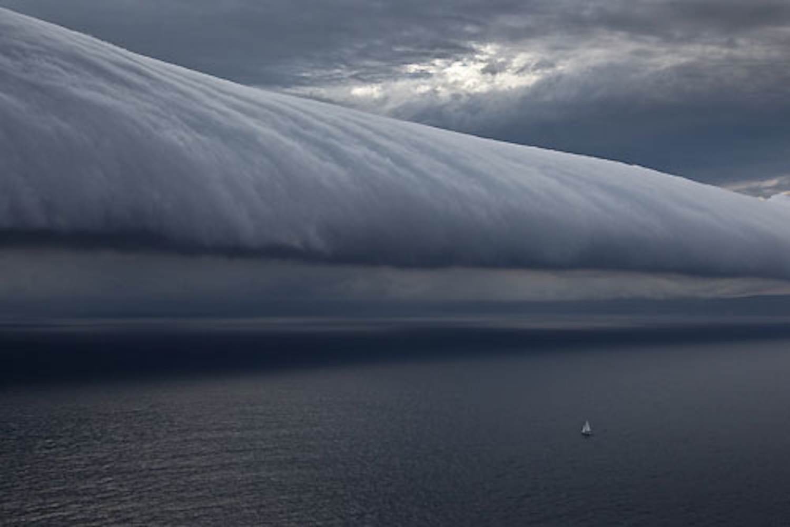
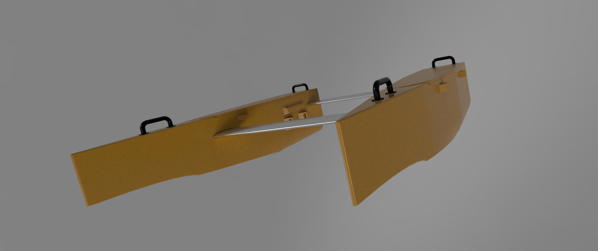
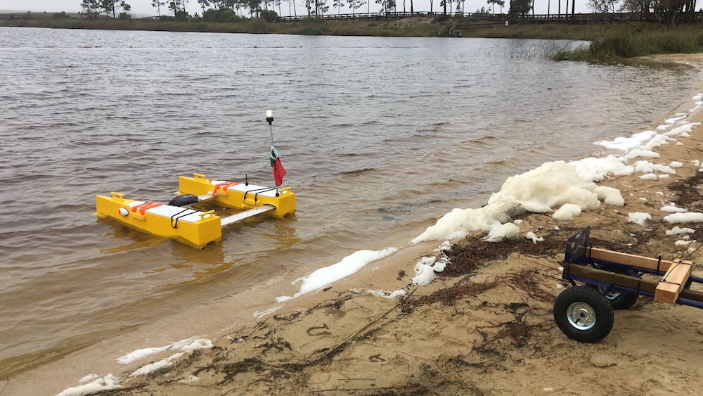

# General view

> Portugal is 97% water



The southerly buster storm front rolling up the New South Wales South Coast, ahead of the first night at sea, after the start of the Rolex Sydney Hobart Yacht Race 2010, Australia. Photo © Carlo Borlenghi / Rolex. www.carloborlenghi.com. 

## About AQUA

AQUA is a small autonomous vessel designed for biowater research and aquatic engineering education. This project's core strategy is to consider environmental sustainability from start to finish. All stages, from fabrication to the end of life, should be environmentally friendly.

The team's values are rooted in the **4R's (Reduce, Reuse, Recycle, Recover)** and **circular economy principles**, aiming to meet these standards by at least **70%**. The project also seeks to raise awareness about water and ocean systems, which is especially important since **Portugal's territory is 97% water**.

## Mission

The goal is to construct an DIY affordable and easily maintainable 1.2-meter catamaran from mostly sustainable materials. This vessel will be designed for a 10 kg payload capacity and at least 2 hours of autonomous operation. 

A crucial part of the design is making it a flexible platform for various research applications, with accessible mounting points for both internal and external sensors.

The goal is to provide the research community with a simple, easy-to-repair, and **open-source water platform system**. The vessel will be constructed using **3D printing** with materials that are biodegradable. 

This approach ensures environmental friendliness from the initial conceptualization to the end of its service life. What should it be used for after that? Its components are designed for reuse.

## Technical Specifications & Operation

The vessel will operate using manual control with a video display, GPS waypoints, and an autonomous collision avoidance system. It is designed to be **user-friendly**, built with affordable, readily available components, and simple to repair. The battery life is designed to last for two hours.

## Vessel Design & Function

This **1.2-meter-long catamaran** is intended for use in calm, inland waters during good weather conditions with 50 cm waves. It is autonomous and carries a structure to transport sensors for gathering local physical and chemical data.

## Vision and Impact

We believe this project aligns with a crucial strategy for Portugal: taking care of the sea by learning about it and defending it as a long-term asset. This initiative can serve as a major footprint for the nation's commitment to marine environmental stewardship.
This project is documented as a journal in the file with the name "journal".



# FEATURES
- A Simple Aquatic Robotics Platform for Training, Education, and Research
- Reusable, affordable and biofriendl up to 80%
- Low cost, simple use, acessible and cheap maintance
- 10 kg payload
 
# TEAM
António Gonçalves, Lab Aberto FAB LAB coordinator and teacher, project coordinator and aqua system assembly and control  
Nuno Gomes, teacher at ESAD - IPLEIRIA and Innovation Makers Labs, Designer Director  
David Rodrigues, PhD, ESAD - IPLeiria, avoidance systems

# We are here:

```geojson
{
  "type": "FeatureCollection",
  "features": [
    {
      "type": "Feature",
      "id": 1,
      "properties": {
        "ID": 0
      },
      "geometry": {
        "type": "Polygon",
        "coordinates": [
          [
              [-9.45,39.5],
              [-9.45,38.7],
              [-9.1,38.7],
              [-9.1,39.5],
              [-9.45,39.5]
          ]
        ]
      }
    }
  ]
}
```

# HISTORY
It all started here, at FAB ACADEMY 2019, held in FCT FAB LAB at Nova University, Caparica Campus, Almada, Lisbon, Portugal [FAB ACADEMY 2019](https://fabacademy.org/2019/labs/fct/students/antonio-gomes/). This was the final [incompleted] project, at the [FCT FAB LAB](https://www.fctfablab.fct.unl.pt/), Filipe Silvestre, as the local instructor and Luís Carvão, as the node instructor, course coordenated by the [FABACADEMY](https://fabacademy.org/), by professor Neil Gershenfeld.

Since then, the Lab Aberto FAB LAB have supported two catamarans made by our intership (Guilherme Cruz) and by the Lab Aberto team, with that they were the winners of 2018 Sunset Hackathon in Ilhavo (Aveiro - Portugal). 

At this moment we gather, informally, a few expertises of different areas to develop a project that need time to set the hulls on the water. We have also another "AQUA" which is a body board with same components to serve as pilot test platform, owned by tha Lab Aberto FAB LAB assotiation. And we are a spinoff of LAB ABERTO FAB LAB, building a first prototyping more close to a small catamaran vessel for inside water bodies training and research.

After being tested, our aim is to share it with MARE in Peniche - Portugal (this is a department of the Polytechnic Institue of Leiria) for further testing in a real framework of researchers and students. 


# PROJECT STATUS

Repairing!




# SUPPORT

 - Associação Lab Aberto FAB LAB, [non-profit association](https://lababerto.pt)
 - António Marçal, advising and workshop space, Marçal Metalworking
 - Marko Mauser, [Mauser](https://mauser.pt/)
 - Tiago Elias, Maker, 3D printing
 - Paulo Teixeira, 3D printing, [FABLAB EDP/Labelec](https://www.edp.com/pt-pt/inovacao/fablab)
 - Gonçalo Pereira, batteries training and electric circuit adviser, [LCD Porto](https://lcdporto.org/pt/pagina-principal/)
 - Álvaro brito, MAKER, 3D printing
 - Renan Portocarrero, MAKER, 3D printing
 - Rui Infante, FAB LAB Porto de Mós, CNC milling
 - Alexandre Nunes, Intership, 3D printing and testing
