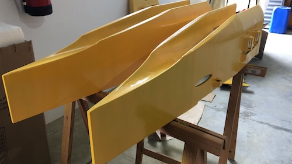

# RESUME
Aqua is a small autonomous vessel for research and aquatic engineering learning. 
This project pretends to considerer to be envitronmentaly sustaible from start to end: meaning that,
all the steps, from fabrication to the end of life, should be environmentally friendly. This team values should
always be under the 4R's and circular economy principles, at least to a 70% degree.

The catamarã is a 1,2 m long and it pretends to be used in inside waters in good weather conditions. It is autonomous and carries a structure to transport sensores and gather local information of physical and chemical parameters.

> Portugal is 97% water

Because of this fact, we think that Portugal should set this strategy as a major footprint: taking care of the sea by knowing about it and defende it as an asset for the long future.

# TEAM
António Gonçalves, Lab Aberto FAB LAB coordinator, control systems  
Nuno Gomes, CEO XYZLAB  
David Rodrigues, PhD, avoidance systems

# HISTORY
This starts is based in the [FAB ACADEMY 2019](https://fabacademy.org/2019/labs/fct/students/antonio-gomes/), as the final [incompleted] project, at the [FCT FAB LAB](https://www.fctfablab.fct.unl.pt/), Filipe Silvestre, as the local instructor and Luís Carvão, as the node instructor, course coordenated by the [FABACADEMY](https://fabacademy.org/), by professor Neil Gershenfeld.

Since then, the Lab Aberto FAB LAB have supported two catamarans made by our intership (Guilherme Cruz) and by the Lab Aberto team, with that they were the winners of 2018 Sunset Hackathon. 

At this moment we gather, informally, a few experties of different areas to develop a project that need time to set the hulls on the water. We have a "AQUA" which is a body board with same components to serve as pilot test platform, owned by tha Lab Aberto FAB LAB assotiation. And we are a spinoff of LAB ABERTO FAB LAB, building a first prototyping more close to a small catamaran vessel for inside water bodies training and research.

After being tested we will deliver it to the MARE in Peniche - Portugal (this is a depratment of the Polytechnic Institue of Leiria) for further testing in a real framework of researchers and students. 

# STATE

At this moment we are finnishing the hulls by painting them, in a process that is not environmentally friendly as we suspected: so, we plan to produce this catamara in a different way by taking the 3D printing strategy further, meaning that, we do not wanted to add to much to the 3D printing process: just the UV painting.

This project is documented as a journal in the file with the name "journal".

# SUPPORT

Associação Lab Aberto FAB LAB  
António Marçal, Marçal metalomecânica  
Marko Mauser, [Mauser](https://mauser.pt/)
