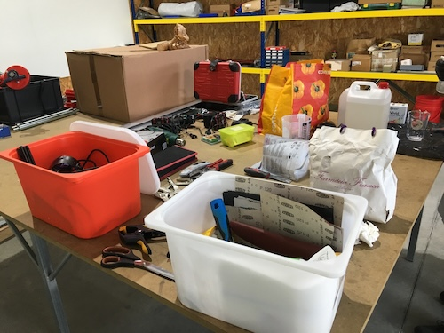
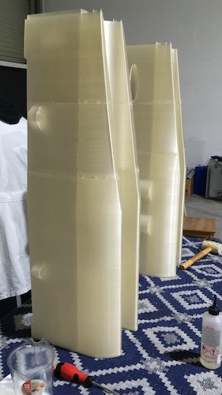
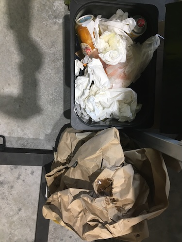
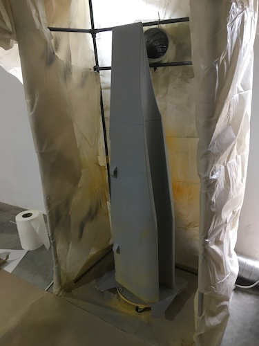
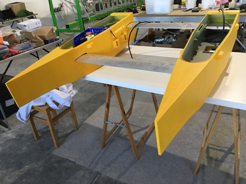

s# 2019

## July ##

Idea: build a small catamara (1,2 m) to be used on maritime engeneering training and biowater research. It should be 70% sustainable from A to Z. It should use 3D printing with new materials, and be more environmentally friendly from the very begining of the conceptualization until the moment that is out of service: what shoul it be used for? It should run by GPS way points and have an avidance system. It should user friendly and built with cheap components available on the market.

# 2023

## July ##

CAD design

## September ##
Printed parts at MAUSER 3D printing services:[MAUSER](https://mauser.pt/catalog/)

### Security ###

Using gloves and special masks.

# 2024 #
## Jannuary ##
Glueing the parts at the António Narçal workshop.
Workshop overview!

We are using the bodyboard as a testing for all of the processes.

## February ##
Resin the hulls. Because of the weather its was a very slow process. 
We never reach the minimum temperature of 21 degrees and 60% of humidity.

As youu can see, there is a chemical reaction between the resin and the paint. The good news is that, if you repaint, it will vanishes! great!!!

And what an ammount of garbadge.

Primary painting. All the errors appear!

## March ##

Fill the holes and repaint after sanding, sanding and sanding. Repaint again. This process is not going well because it continues to react showing spots of orange (see pictures). We think to change the process in order to have more 3D printed only and putting the UV paint only. It avoids a lot of work and mess.

## April ##

In April we finnaly concluded the painting.

We did the UV paint with this brand.

The process is not environmentally friendly as we suspected: so, we plan to produce this catamara in a different way by taking the 3D printing strategy further, meaning that, we do not wanted to add to much to the 3D printing process, just the UV painting, and we want to assume the 3D printing "anommalous" desing by not be embarassed because of this consequent strange design. We will not 

## May ##

Spaghetti time. Designing the wiring and accomodating the hardware to control the AQUA.

We are also looking the way to adjust, with flexible material, the front and rear bars that go inside the boat. They are connected by two screws in each side.

Future: looking forward to test it in a pool. 

##July##
Cleaning was a task at this point and measuring the type of garbage and the weight in percentage of the catamaran is a reference to take this item into account. We don't have the complete weigth of the catamaran. So we will complete this table later on.

| Type  | Weigth (kg) | % |
| ------------- | ------------- | ------------- |
| Paper  | 1,2 |  |
| Cardboard | 5,6 | |
| Plastic  | 5,8 | |
| Painting cans | 1,8 (18 cans) ||
| Metal | 3,4 |  |
| undifferentiated waste | 4,3 |  |

In July we stop here:

To be solve until the end of the year:
- [ ] Decide how to make the avoidance, by camera using the human hand or autonolously by pattern detecting: perhaps both; 
- [ ] close the floats on top taking care of the antennas position and the camera position to.
- [ ] Testing the boat by radio controler and GPS waypoints

##September##
