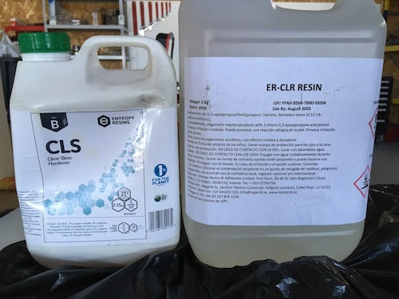
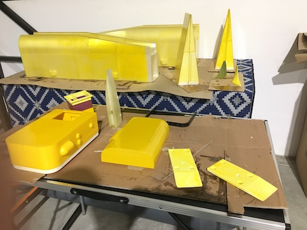

# 2019

## July ##

idea: build a small catamara (1,2 m) to be used on maritime training and research. It should be 70% sustainable from A to Z. It should use 3D printing with new materials, more environmentally friendly.

# 2023

## July ##

CAD design

## September ##
Printed parts at MAUSER 3D printing services:[MAUSER](https://mauser.pt/catalog/)

### Security ###

Using gloves and special masks.

# 2024 #
## Jannuary ##
Glueing the parts at the António Narçal workshop.
Workshop overview!

We are using the bodyboard as a testing for all of the processes.

## February ##
Resin the hulls. Because of the weather its was a very slow process. 
We never reach the minimum temperature of 21 degrees and 60% of humidity.

And what an ammount of garbadge.

Primary painting. All the errors appear!

## March ##

Fill the holes and repaint after sanding, ssanding and sanding. repaint again.
